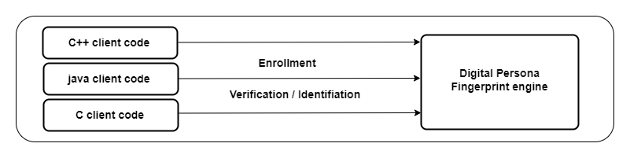

# FingerPrint web App
## FingerPrint Enrolment and Verification web App using Digital Persona U.are.U 4500 FingerPrint Scanner and SDK v3 in PHP
---
## Before you start
Please note that php is not my primary language and this whole project started as a necessity. Since then I have made many iterations and improvements. What you have here is just a proof of concept. You might have to make a few easy tweaks to fit your needs
## Introduction
This started when I needed to implement a fingerprint solution to an existing php codebase, with a very limited amount of time. Some of the challenges I faced were:
- Lack of access to the software forum, in fact there was no way to reach the developers and seek for help.
- The SDK in my opinion was terribly lacking
- The documentation left so many details out
- Most importantly, there was no way to integrate with many languages, like python, php etc.

Nonetheless, I managed to put together somewhat of a hack. It involved disassembling a dll, piecing together information cached by google from different parts of the forum when it was active and a lot of head banging. Initially this solution only worked on windows, using the [dotnet](link_here) feature of php. After several iterations, what you now have is a cross platform solution, without relying on php dotnet.
## So what is this really?
This is an attempt to make using the fingerprint scanner easy, without having to deal with the hurdles I faced when I started out.

Initially, we had:



the only way to interact with the fingerprint software engine was to use C++, java, C#, C etc. None of these allowed for a smooth, easy or straightforward  integration with modern web technologies. So I thought we needed a way to work with languages like python, javascript, php, etc.

### The Solution
We wrap the fingerprint engine with [grpc](https://grpc.io/) and [protobuf](https://developers.google.com/protocol-buffers/). This allows us to use the engine in any language supported by grpc and there are quite a lot of them. But this is not what this codebase is about. You can find the link to the grpc codebase [here](https://github.com/Bexils/grpc-fingerprint-engine). I realized most people just needed a solution they could plugin to their codebase and forget about it and hence why this codebase was created. It's an abstraction of the grpc solution, completely containerized with docker that can be setup and ready to use with just a few commands. This solution setup a web services on your local machine or server that can be used to make enrollment and verification requests.
## Getting started
### Download SDK (Mandatory)
Note: the SDK below is for windows only. Considering most people will be using the scanner on windows (i.e the frontend or client side), if you are already able to capture fingerprint with the device you don't even need this. The solution for the backend enrollment and verification service doesn't require any of this, as it's already packaged in the container.

Unplug the fingerprint scanner from the device if connected.

Download the SDK below and install it, also install the patch and restart the computer if requested.

SDK v3 [Download](https://drive.google.com/open?id=1Hg3HAqwLuqmi9F4eUAgb5WaeLyJvPQq5)  
SDKPatch [Download](https://drive.google.com/file/d/1yB0oW3NtBfCBKFHSe0Blc7B7grMD854W/view?usp=sharing)

### Setup the web service (Mandatory for all users)
Regardless of where you need to set this up, you will have to install docker, which is very easy to do.

### Install Docker for Windows (Mandatory for windows users)
Download Docker Desktop for windows [here](https://desktop.docker.com/win/main/amd64/Docker%20Desktop%20Installer.exe) or [visit the page](https://docs.docker.com/desktop/windows/install/) for more information.

### Install Docker for Linux (Mandatory for Linux users)
For linux users, you can use the convenience script method or visit the official doc [here](https://docs.docker.com/engine/install/)

```bash
curl -fsSL https://get.docker.com -o get-docker.sh
DRY_RUN=1 sh ./get-docker.sh
# install compose
sudo curl -L "https://github.com/docker/compose/releases/download/1.29.2/docker-compose-$(uname -s)-$(uname -m)" -o /usr/local/bin/docker-compose
# make it executable
sudo chmod +x /usr/local/bin/docker-compose
# test the installation
docker-compose --version
```
### Build and Start the service (Mandatory)
If you have done everything above correctly, you should be able to build and start the service.

```bash
# if you haven't already,
git clone https://github.com/Ethic41/FingerPrint.git
cd FingerPrint

# change to the docker service directory
cd fingerprint_service

# build and start the service
docker-compose up
```

### Test the service
Copy this repo to your server web root directory. Assuming apache web server (of course you can use anthing you want).

For windows users using xampp, that will be C:\xampp\htdocs or thereabouts.

For linux users, that will be /var/www/html or thereabouts.

Visit http://localhost/FingerPrint or http://localhost
depending on your web root configuration. I do advice to change the web root directly to the FingerPrint directory.

Note: For this test we use a mysql database, but you can use any other database you want. You will need to have a database named `fingerprint`, with the below structure.

```sql
/*create fingerprint database*/
CREATE DATABASE fingerprint;

/*create users table, with id as primary key
username, fullname columns and also nullable index and middle finger columns*/
CREATE TABLE `users` (
  `id` int(11) NOT NULL AUTO_INCREMENT,
  `username` varchar(255) NOT NULL,
  `fullname` varchar(255) NOT NULL,
  `indexfinger` varchar(4000) NULL,
  `middlefinger` varchar(4000) NULL,
  PRIMARY KEY (`id`)
) ENGINE=InnoDB DEFAULT CHARSET=latin1;
``` 
Add some data and leave the index finger and middle finger columns empty. Now you should be able to enroll and verify fingerprints.
